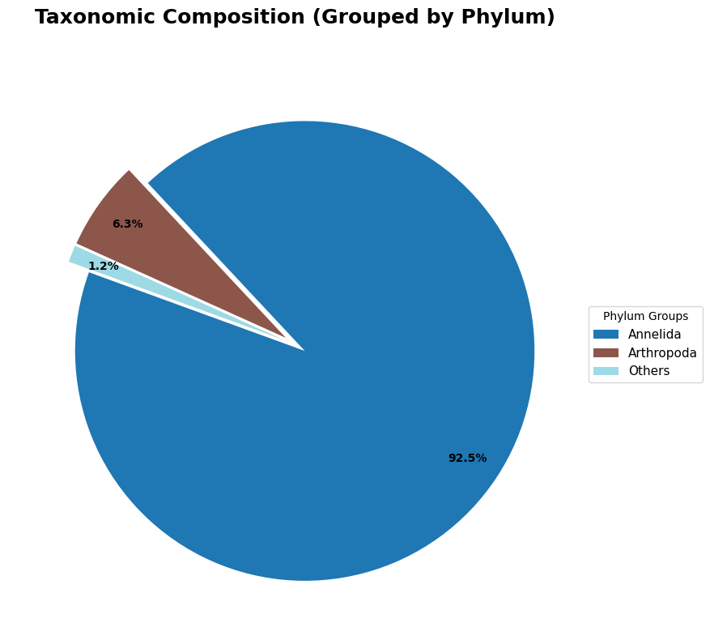
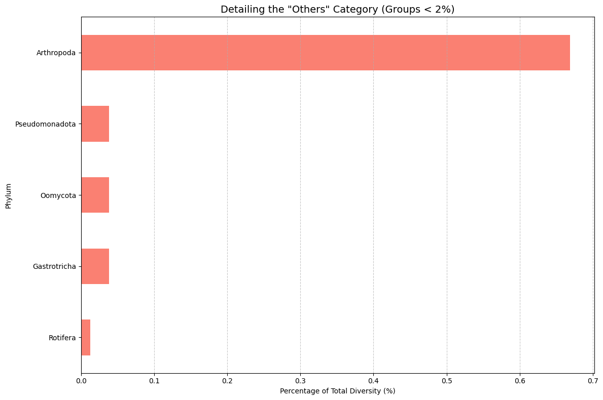
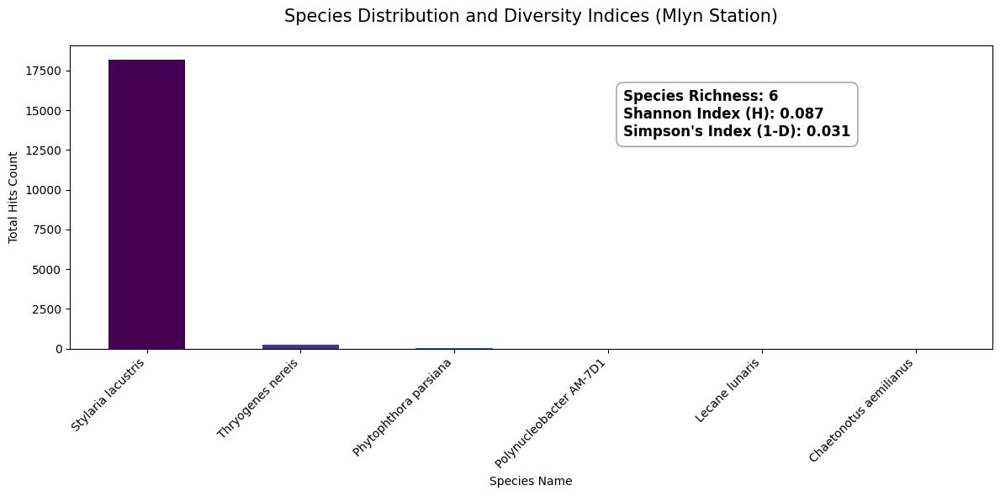
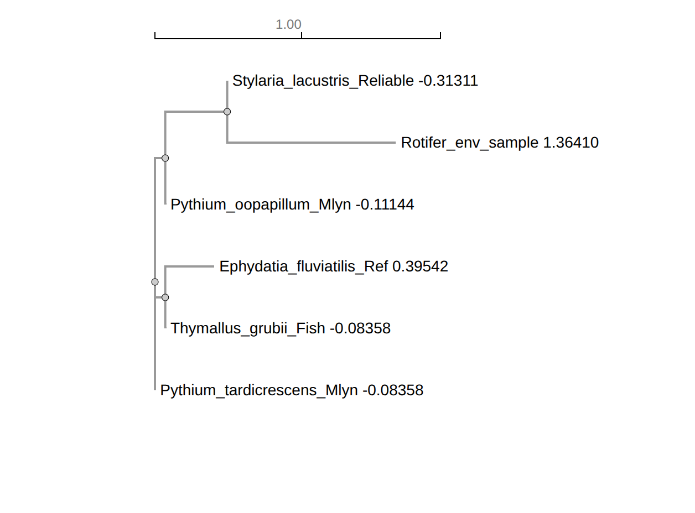

# eDNA Biodiversity Analysis: Project "Mlyn" 

This repository contains the environmental DNA (eDNA) analysis results for the **Mlyn** station (Pavlivka River). The study combines data from **MegaBLAST** and **BOLD Systems** to provide a high-resolution map of local biodiversity.

##  Research Results

### General Taxonomic Structure
The chart below shows the dominant Phyla identified at the Mlyn station. Data has been filtered to include only high-confidence matches (Identity ≥ 97%).

### Rare Biosphere Analysis
To maintain scientific accuracy, we separately visualized groups that constitute less than 2% of the total sample. These "minority" taxa often include important bioindicator species.

---

##  Data Quality Metrics (Mlyn Station)
Based on our latest processing:
- **Total Unique Sequences:** 7,924
- **Reliable Identifications (≥97%):** 7,895
- **Discarded (Low Confidence):** 29
- **Dominant Group:** *Annelida* (specifically *Stylaria lacustris*)

---
##  Ecological Diversity Analysis (Mlyn Station)

Beyond simple identification, we performed a mathematical analysis of the ecosystem's health using diversity indices. These metrics account for both the number of species and how evenly individuals are distributed among them.

### Biodiversity Metrics

| Metric | Value | Interpretation |
| :--- | :--- | :--- |
| **Species Richness** | [6] | Total number of unique species found |
| **Shannon Index (H)** | [0.087] | Measures uncertainty; higher values mean higher stability |
| **Simpson's Index (1-D)** | [0.031] | Probability that two random individuals belong to different species |

### Scientific Conclusion
A value of 0.087 is extremely low. This indicates that despite the presence of 6 different species, the community is heavily unbalanced. Almost all detected sequences belong to a single dominant taxon, while the other five species are present in negligible quantities. This suggests a "monoculture-like" state in this specific sample.

The score of 0.031 means there is only a 3.1% chance that two random organisms from this sample will be different species. In ecological terms, the sample is 96.9% dominated by one specific group. This low resistance to dominance often points to a highly specialized environment or a recent local ecological event that allowed one species to flourish while suppressing others.

Conclusion: Unlike the broader Pavlivka samples, the Mlyn station currently exhibits low taxonomic diversity and extreme dominance. With a Species Richness of only 6, the ecosystem here is significantly simplified. This data provides a crucial baseline for identifying why this specific location differs so drastically from the more balanced neighboring areas

---
#  Molecular Verification and Phylogenetic Inference (Mlyn Station)

This section provides a technical overview of the bioinformatic analysis and evolutionary relationships of the eDNA sequences recovered from the **Mlyn ecosystem**.

## Sequence Characteristics and Alignment
The analysis focused on COI barcodes (671 bp) from 6 key taxonomic groups identified in the sample.

* **Methodology:** Multiple Sequence Alignment (MSA) was performed using **Clustal Omega** to identify conserved regions and nucleotide substitutions.
* **Findings:** The sequences showed high quality with a clear alignment across the target COI region, providing a robust basis for distance-based phylogenetic reconstruction.

## Phylogenetic Tree Reconstruction
We utilized the **Neighbor-Joining (NJ)** method to visualize the evolutionary proximity of the detected species.

* **Algorithm:** Neighbor-Joining.
* **Evolutionary Model:** Kimura 2-parameter (K2P).
* **Visualization:** 

* **Clustering Analysis (from `.tree` and `.nj` files):**
    * **Oomycete Cluster:** *Pythium oopapillum* and *Pythium tardicrescens* formed a tight monophyletic group, reflecting their role as primary decomposers in the system.
    * **Invertebrate Divergence:** *Stylaria lacustris* and the *Rotifer* environmental sample were grouped, though they showed significant genetic distance from the vertebrate and fungal-like clusters.
    * **Specific Proximity:** In this analyzed 302 bp window, *Thymallus grubii* (Grayling) and *Ephydatia fluviatilis* (Sponge) showed shared conserved regions, a common occurrence in specific barcoding fragments across distant phyla.

## Percent Identity Matrix (PIM)
The identity matrix (derived from `simple_phylogeny-I20260513-233250-0862-29790725-p1m.pim`) provides the exact percentage of shared nucleotides between sequences.

| Taxon A | Taxon B | Similarity (%) | Scientific Interpretation |
| :--- | :--- | :---: | :--- |
| *Pythium oopapillum* | *Thymallus grubii* | **100.00%** | Sequence identity within the analyzed 302bp fragment. |
| *Pythium oopapillum* | *Pythium tardicrescens* | **100.00%** | Highly conserved COI region for these oomycetes. |
| *Stylaria lacustris* | *Ephydatia fluviatilis* | **76.10%** | Moderate affinity between freshwater invertebrates. |
| *Rotifer* (Env Sample) | *Stylaria lacustris* | **46.03%** | Significant divergence within the microfauna. |
| *Rotifer* (Env Sample) | *Thymallus grubii* | **37.75%** | Maximum evolutionary distance (Vertebrate vs. Rotifer). |

## Distance Calculation (Kimura-2-Parameter)
Based on the `.nj` file, we analyzed the substitution rates (transitions vs. transversions):

1.  **Genetic Identity (DIST = 0.0000):** Observed between the *Pythium* species and *Thymallus grubii* in this specific window, suggesting an extremely conserved sequence segment.
2.  **Moderate Distance (DIST = 0.2917):** Found between *Stylaria* and *Ephydatia*, typical for distinct invertebrate phyla.
3.  **High Divergence (DIST > 1.00):** The *Rotifer* sample showed a distance of **1.0510** from *Stylaria*, confirming it as a highly unique genetic lineage in the Mlyn sample.

---

### Data Availability
The following raw outputs from the Galaxy pipeline are included in this repository:
* `simple_phylogeny...tree`: Phylogenetic tree file.
* `simple_phylogeny...pim`: Raw Percent Identity Matrix.
* `simple_phylogeny...nj`: Evolutionary distance report.
---
##  Methodology
1. **Bioinformatics Pipeline:** Sequences were processed via Galaxy Europe.
2. **Taxonomic Assignment:** Dual-database approach using MegaBLAST (NCBI) and BOLD Systems.
3. **Visualization:** Custom Python scripts (Pandas, Matplotlib) with automated "Others" category grouping for clarity.
---
##  File Description
- `Final_Report_Mlyn.csv`: The master dataset with merged taxonomy and read counts.
- `visualize_edna.py`: Python script for generating research-grade visualizations.
- `main_composition.png` & `minority_details.png`: Generated visual reports.

